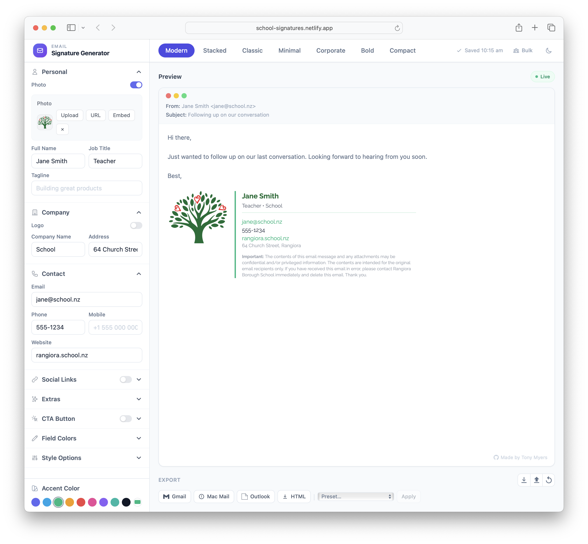

# Email Signature Generator

A web-based email signature generator built for schools. Create professional, branded email signatures with a live preview, multiple templates, and one-click export to Gmail, Outlook, and Apple Mail.



## Features

- **7 signature templates** — Modern, Stacked, Classic, Minimal, Corporate, Bold, and Compact
- **Live preview** — See changes instantly as you edit
- **School presets** — Pre-configured branding for quick setup (e.g. Rangiora Borough School)
- **Photo support** — Upload, embed, or link to a photo/logo via URL
- **Social links** — Add links to social media profiles
- **CTA button** — Optional call-to-action button (e.g. "Book a meeting")
- **Custom colors & fonts** — Match your school's brand identity
- **Bulk processing** — Import staff details via CSV, generate signatures in bulk, and download as a zip
- **Dark mode** — Full dark mode support
- **Retailer accounts** — Businesses sign up, an admin approves them, and they can save signatures to their account and brand the app header with their logo

## Export Options

- **Gmail** — Copy to clipboard, paste directly into Gmail signature settings
- **Apple Mail** — Download as a `.mailsignature` file
- **Outlook** — Copy as HTML for Outlook signature settings
- **HTML** — Download raw HTML for manual setup
- **Shareable link** — Generate a URI to share or reapply a signature configuration

## Getting Started

```bash
# Install dependencies
npm install

# Start dev server
npm run dev

# Build for production
npm run build
```

## Retailer Accounts (Neon + Netlify Functions)

Accounts, approvals and saved signatures are stored in a [Neon](https://neon.tech) Postgres database and served by a Netlify Function at `/api/*` ([netlify/functions/api.mts](netlify/functions/api.mts)). The editor requires an approved account; logged-out visitors are sent to `/login`.

1. Copy `.env.example` to `.env` and set:
   - `DATABASE_URL` — your Neon connection string
   - `ADMIN_EMAILS` — comma-separated emails that become approved admins when they sign up
2. Create the tables: `npm run db:migrate` (safe to re-run)
3. `npm run dev` — the API runs inside the Vite dev server, no Netlify CLI needed
4. Sign up at `/signup` with an admin email, then approve retailers at `/admin`

On Netlify, add `DATABASE_URL` and `ADMIN_EMAILS` under **Site configuration → Environment variables**.

## Tech Stack

- [Vue 3](https://vuejs.org/) with `<script setup>` SFCs
- [TypeScript](https://www.typescriptlang.org/)
- [Vite](https://vitejs.dev/)
- [Tailwind CSS](https://tailwindcss.com/)
- [Pinia](https://pinia.vuejs.org/) for state management
- [JSZip](https://stuk.github.io/jszip/) for bulk zip downloads
- [Neon](https://neon.tech) serverless Postgres + Netlify Functions for accounts

## License

MIT
